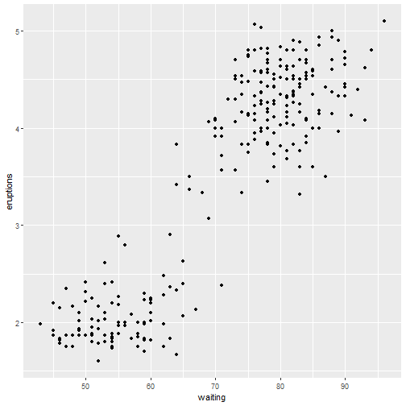

PredictEruptionDuration App
========================================================
author: by Fabiobianco
date: "25/12/2020"
autosize: true

2 - First Slide
========================================================

For more details on authoring R presentations please visit <https://support.rstudio.com/hc/en-us/articles/200486468>.

- Bullet 1
- Bullet 2
- Bullet 3

3 - Slide With Code
========================================================


```r
summary(faithful)
```

```
   eruptions        waiting    
 Min.   :1.600   Min.   :43.0  
 1st Qu.:2.163   1st Qu.:58.0  
 Median :4.000   Median :76.0  
 Mean   :3.488   Mean   :70.9  
 3rd Qu.:4.454   3rd Qu.:82.0  
 Max.   :5.100   Max.   :96.0  
```

```r
head(faithful)
```

```
  eruptions waiting
1     3.600      79
2     1.800      54
3     3.333      74
4     2.283      62
5     4.533      85
6     2.883      55
```

4 -Slide With Plot
========================================================


```r
library(ggplot2)
        g <- ggplot(faithful, mapping = aes(waiting, eruptions)) + geom_point()
        g <- g + geom_smooth(method = loess)
        g
```



5 - Slide With Plot
========================================================


```r
library(caret)
    fit <- train(eruptions ~ ., data = faithful, method = 'lm')
    fit
```

```
Linear Regression 

272 samples
  1 predictor

No pre-processing
Resampling: Bootstrapped (25 reps) 
Summary of sample sizes: 272, 272, 272, 272, 272, 272, ... 
Resampling results:

  RMSE       Rsquared   MAE      
  0.4951703  0.8162086  0.4019887

Tuning parameter 'intercept' was held constant at a value of TRUE
```


