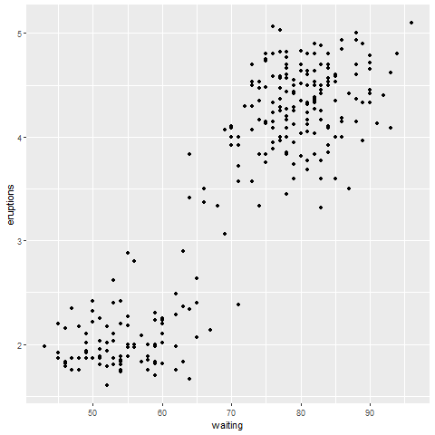
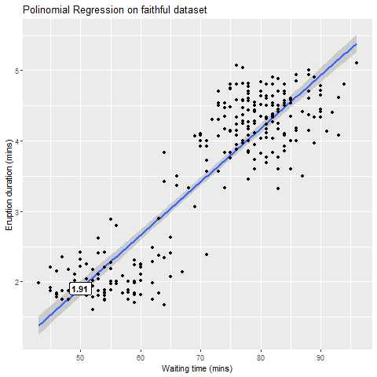
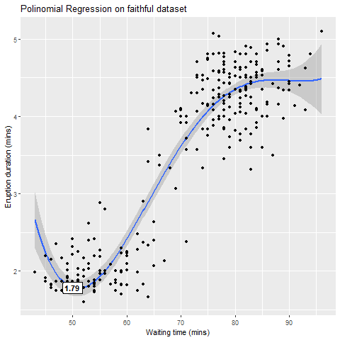

Predict Eruption Duration Shiny app
========================================================
author: by Fabiobianco
date: "January 1, 2021"
autosize: true


<script type="text/javascript"
  src="http://cdn.mathjax.org/mathjax/latest/MathJax.js?config=TeX-AMS-MML_HTMLorMML">
</script>


- <small>[*The Github repo link*] (https://github.com/fabiobianco/DevelopingDataProducts/tree/main/PredictEruptionDuration)</small>
- <small>[*The Shiny app link*] (https://fabiobianco.shinyapps.io/PredictEruptionDuration/)</small>


Shiny app logic descripotion
========================================================
<small>In this Shiny app we apply a *Polinomial Regression Model* to the *Faithful Dataset* to predict the Eruption duration. What you will see is that the prediction improves as the degree of the polynomial increases.
The *Faithful dataset* contains details of the eruption duration and the waiting time in between eruptions of the [Old Faithful Geyser](https://en.wikipedia.org/wiki/Old_Faithful) in Yellowstone National Park in Wyoming, United States.</small>


```r
head(faithful)
```

```
  eruptions waiting
1     3.600      79
2     1.800      54
3     3.333      74
4     2.283      62
5     4.533      85
6     2.883      55
```


Plot the Faithful Dataset
========================================================


```r
library(ggplot2)
g <- ggplot(faithful, mapping = aes(waiting, eruptions)) + geom_point()
```




Eruption prediction with 1 degree Polynomial
========================================================
<small>In this case the relationship between the independent variable x and the dependent variable y is modelled as an 1 degree polynomial in x</small>

```r
waiting_time = 50 # Waiting time for eruption prediction
pol_degree1 = 1   # Polinomial degree
```


```r
as.numeric(results$fit[1])  # Eruption duration predicted
```

```
[1] 1.907381
```




Eruption prediction with 4 degree Polynomial
========================================================
<small>In this case the relationship between the independent variable x and the dependent variable y is modelled as an 4 degree polynomial in x</small>

```r
waiting_time = 50 # Waiting time for eruption prediction
pol_degree4 = 4   # Polinomial degree
```


```r
as.numeric(results$fit[1]) # Eruption duration predicted
```

```
[1] 1.786183
```




